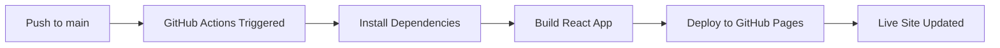

# DevInsight - AI GitHub Analyzer

🚀 **Transform your GitHub repositories into actionable insights with AI-powered analysis**

[](https://github.com/maaz404/Devinsight/actions/workflows/deploy-frontend.yml)
[](https://maaz404.github.io/Devinsight)

## 🌟 Overview

DevInsight is a comprehensive full-stack application that analyzes GitHub repositories using AI to provide detailed insights about code quality, documentation, and best practices. Get instant feedback on your projects with beautiful, actionable reports.

## 📸 Screenshots

### 🏠 Landing Page

<!-- Add your landing page screenshot here -->


_Clean, modern landing page with clear value proposition and call-to-action_

<br/>

### 🔍 Repository Analysis

<!-- Add your analysis page screenshot here -->


_Intuitive interface for entering GitHub repository URLs and starting analysis_

<br/>

### 📊 AI-Powered Dashboard

<!-- Add your dashboard screenshot here -->


_Comprehensive dashboard showing code quality metrics, insights, and recommendations_

<br/>

### 📈 Detailed Reports

<!-- Add your reports screenshot here -->


_Beautiful visual reports with actionable insights and performance metrics_

<br/>

---

## 🛠️ Tech Stack


## ⚡ Quick Start

### Prerequisites

- Node.js 18+
- npm or yarn
- Git

### Installation

```bash
# Clone the repository
git clone https://github.com/maaz404/Devinsight.git
cd Devinsight

# Install all dependencies
npm run install:all

# Start development servers
npm run dev:both
```

### Development

```bash
# Frontend only (React + Vite)
npm run dev:client

# Backend only (Node.js + Express)
npm run dev:server

# Build for production
npm run build
```

## 🚀 Auto-Deployment with GitHub Actions

This project uses **GitHub Actions** for automatic deployment to GitHub Pages. Every time you push changes to the `client/` folder, the site automatically rebuilds and deploys!

### 🔄 Deployment Workflow



### ✨ Features

- **🚀 Automatic Deployment**: Push changes → Live in 2-3 minutes
- **🎯 Smart Triggers**: Only deploys when `client/` files change
- **🔒 Secure**: Uses GitHub's built-in GITHUB_TOKEN
- **📊 Monitoring**: Track deployment status in Actions tab
- **⚡ Fast Builds**: Optimized with Vite for quick builds

### 🛠️ How It Works

1. **Make UI Changes** in the `client/src/` folder
2. **Commit & Push** your changes:
   ```bash
   git add .
   git commit -m "✨ Updated landing page design"
   git push origin main
   ```
3. **GitHub Actions Automatically**:
   - Detects changes in client folder
   - Installs dependencies with `npm ci`
   - Builds the React app with `npm run build`
   - Deploys to GitHub Pages
4. **Live Site Updates** at [https://maaz404.github.io/Devinsight](https://maaz404.github.io/Devinsight)

### 📋 Deployment Configuration

```yaml
# .github/workflows/deploy-frontend.yml
name: 🚀 Deploy Frontend to GitHub Pages

on:
  push:
    branches: [main]
    paths: ["client/**"]

jobs:
  build-and-deploy:
    runs-on: ubuntu-latest
    permissions:
      contents: read
      pages: write
      id-token: write
```

### 🎯 Development Workflow

```bash
# 1. Local Development (instant feedback)
npm run dev:client
# Make changes, see them at http://localhost:5173

# 2. Production Testing (optional)
npm run build
npm run preview

# 3. Deploy to Production
git add .
git commit -m "🎨 Improved dashboard UI"
git push origin main
# ✅ Auto-deployed in ~2 minutes!
```

## 📁 Project Structure

```
DevInsight/
├── .github/workflows/      # 🚀 GitHub Actions for auto-deployment
│   └── deploy-frontend.yml
├── client/                 # ⚛️ React Frontend (Vite)
│   ├── src/
│   │   ├── components/
│   │   ├── pages/
│   │   ├── utils/
│   │   └── App.jsx
│   ├── public/
│   ├── package.json
│   └── vite.config.js
├── server/                 # 🟢 Node.js Backend
│   ├── routes/
│   ├── models/
│   ├── controllers/
│   ├── package.json
│   └── index.js
├── screenshots/            # 📸 Project screenshots
├── package.json           # 📦 Workspace configuration
└── README.md
```

## ✨ Features

### 🔍 Core Functionality

- **📊 Repository Analysis** - Deep analysis of GitHub repositories
- **🤖 AI-Powered Insights** - GPT-4 powered code quality assessment
- **📈 Visual Reports** - Beautiful dashboards with score meters and metrics
- **💾 Data Persistence** - MongoDB storage for analysis history
- **⚡ Real-time Processing** - Fast analysis with progress indicators

### 🛡️ Security & Performance

- **🔐 Secure API Integration** - Protected GitHub token handling
- **⚡ Optimized Builds** - Vite for lightning-fast development
- **📱 Responsive Design** - Works on all devices
- **🚀 CDN Delivery** - Fast global content delivery via GitHub Pages

## 🌐 Live Demo

**Frontend**: [https://maaz404.github.io/Devinsight](https://maaz404.github.io/Devinsight)

## 📊 Deployment Status

You can monitor deployment status at:

- **Actions Tab**: [https://github.com/maaz404/Devinsight/actions](https://github.com/maaz404/Devinsight/actions)
- **Deployments**: [https://github.com/maaz404/Devinsight/deployments](https://github.com/maaz404/Devinsight/deployments)

## 🎯 Demo & Usage

### 📱 Mobile Responsive

<!-- Add mobile screenshots here -->
<div align="center">
  
  
</div>

_Fully responsive design works seamlessly on all devices_

<br/>

### 🎨 User Experience

<!-- Add UX flow screenshots here -->


_Smooth, intuitive user experience from analysis to insights_

<br/>

---

## 🤝 Contributing

1. **Fork the repository**
2. **Create a feature branch**: `git checkout -b feature/amazing-feature`
3. **Make your changes** in the `client/` or `server/` folders
4. **Test locally**: `npm run dev:client` or `npm run dev:server`
5. **Commit changes**: `git commit -m '✨ Add amazing feature'`
6. **Push to branch**: `git push origin feature/amazing-feature`
7. **Open a Pull Request**

> 💡 **Tip**: Changes to `client/` will auto-deploy when merged to `main`!

## 📝 Scripts Reference

```bash
# Development
npm run dev:client          # Start React dev server
npm run dev:server          # Start Node.js dev server
npm run dev:both           # Start both servers

# Production
npm run build              # Build React app
npm run preview            # Preview production build
npm run start             # Start production server

# Dependencies
npm run install:all        # Install all dependencies
npm run install:client     # Install frontend deps only
npm run install:server     # Install backend deps only
```

## 🔧 Environment Variables

Create `.env` files in respective directories:

```bash
# client/.env
VITE_API_URL=http://localhost:3000/api

# server/.env
MONGODB_URI=your_mongodb_connection_string
GITHUB_TOKEN=your_github_token
OPENAI_API_KEY=your_openai_api_key
```

## 📄 License

This project is licensed under the MIT License - see the [LICENSE](LICENSE) file for details.

## 👨‍💻 Author

**Maaz Sheikh** - [@maaz404](https://github.com/maaz404)

---

<div align="center">

**⭐ Star this repo if you found it helpful!**

Made with ❤️ and automated with 🚀 GitHub Actions

</div>
